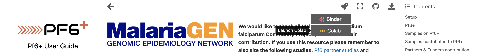

# `Pf6+` - an integrated open data resource of whole-genome sequenced and targeted genotyped Plasmodium falciparum samples

The Pf6+ data resource builds on the efforts of the Pf6 project (https://wellcomeopenresearch.org/articles/6-42/v1) and the GenRe project (https://www.malariagen.net/resource/29); integrating 5,970 WGS samples together with 7,626 Amplicon Sequencing samples. We aim to provide a series of use cases, together with the tools to interact with them, to increase the accessibility of the resource.

This repository provides technical documentation for Pf6+, including access to the data resource and accompanying Jupyter Notebooks.

For further information, please see the [Pf6+ data user guide](https://malariagen.github.io/Pf6plus/).

If you find a bug related to usage, public data or documentation, please raise an issue on this repository.

## Contents
  * [Data Resource](#Data-Resource)
  * [Accesing the Analysis Examples](#Accesing-the-Analysis-Examples)
  * [Running the Notebooks (Google Colab](#Running-the-Notebooks-(Google-Colab))
  * [Running the Notebooks (Locally)](#Running-the-Notebooks-(Locally))
    * [Dependencies](#Dependencies)
    * [How to Install Python Modules in a Virtual Environment](#How-to-Install-Python-Modules-in-a-Virtual-Environment)
    * [Cloning the Repository](#Cloning-the-Repository)
    * [Running Jupyter](#Running-Jupyter)
  * [Documentation for Developers](#Documentation-for-Developers)
    * [Deployment](#Deployment)
    * [Making Changes to the Notebooks](#Making-Changes-to-the-Notebooks)
    * [Data Analysis](#Data-Analysis)
    * [Developing on JupyterLab on the Farm](#Developing-on-JupyterLab-on-the-Farm)


### Data Resource

The main data resource can be accessed through https://pf6plus.cog.sanger.ac.uk/pf6plus_metadata.tsv. This resource is explored through a series of Jupyter Notebooks, accesible from the `pf6plus_documentation` directory in this repository.

- **1_partners.ipynb** : Explores the aggregated WGS and AmpSeq samples (Pf6+ metadata) and the contributors to the resource.
- **2_variants_prevalence.ipynb** : A walk-through from shows some data analysis and visualisation exploring the frequency over time of individual mutations, haplotypes and drug-resistant phenotypes.
- **3_phenotyper.ipynb** : A walk-through example of using the `phenotyper`  tool, to infer drug resistance status from genetic data alone (see https://github.com/malariagen/phenotyper, for further information).

We suggest exploring the Notebooks on this order. 

### Accesing the Analysis Examples

You can view the documentation [here](https://malariagen.github.io/Pf6plus/). The notebooks and output plots are interactive, allowing to explore the different dimensions of the dataset, and to visualise specific data points (e.g. by hovering and zooming in and out using the tool bar).

### Running the Notebooks (Google Colab)

The suggested way to use the resource is to open the notebooks in Google Colab, this will allow you to run code and change parameters, without any need for local installations. To do this open the [documentation](https://malariagen.github.io/Pf6plus/) and select the notebook you would like to open. Click on the rocket icon in the top right hand corner and select `Colab`, as shown below.



### Running the Notebooks (Locally)

To run the notebooks on your own computer you will need to clone this repository and install the following dependencies: 

#### Dependencies

- Jupyter
- Python3 
- numpy
- folium
- matplotlib
- bokeh
- pandas

#### How to Install Python Modules in a Virtual Environment

Running this notebook on your own machine requires Python packages to be installed. We recommend doing this in a virtual environment. 
Open a terminal and follow these instructions:

1. Create a virtual environment by typing out the following commands, replacing `<path to python3>`:

```
virtualenv -p <path to python3> pf6plus_notebooks_env
source pf6plus_notebooks_env/bin/activate
```

Note that if `virtualenv` is not installed on your computer, you will need to use: `pip install virtualenv`. 

2. Install the dependencies in the virtual environment:

```
pip install numpy folium matplotlib bokeh pandas 
```

To exit out of the environment simply type the following on the command line:

```
deactivate
```

If you want to enter the environment again you won't need to re-install the dependencies. Simply enter the following on the command line and it will load up everything you installed before:

```
source pf6plus_notebooks_env/bin/activate
```

#### Cloning the Repository

You will then need to clone this repository to your own machine. Navigate to where you would like to store this and run the following command:

```
git clone https://gitlab.com/malariagen/gsp/pf6plus.git
```

#### Running Jupyter

To launch Jupyter Notebook simply navigate to where you cloned this repo and run the following:

```
cd notebooks
jupyter-notebook
```

## Documentation for Developers

The documentation is a set of Jupyter Notebooks contained in the `pf6plus_documentation/notebooks/` directory.

### Deployment

The notebooks are deployed automatically as a Jupyter Book to GitHub Pages by a GitHub Workflow. This is configured in `Pf6plus/.github/workflows/gh-pages.yml` to install dependencies, build the book, and push it to `gh-pages`. The dependencies are listed in `requirements-deploy.txt`. This will run when a change to anything in the `pf6plus_documentation/` directory is merged into the master branch.

The configuration for the Jupyter Book is set up in the `pf6plus_documentation/` directory by three files:

- **\_config.yml** : contains the configuration for the book.
- **\_toc.yml** : configures the layout for the different sections of the book.
- **landing-page.md** : formats the landing page for opening the book.

### Making Changes to the Notebooks

To make any changes please use a new branch. Before merging into the master branch, you should test any changes locally.
To do this, you will need jupyter-book which can be installed via `pip`.

Navigate to the head directory of the repository and run the following to build the Jupyter Book locally:

```
jupyter-book build pf6plus_documentation
```

If everything is successful this should output a link. Copy and paste this into your browser to check that your changes are as expected.

### Data Analysis

The `pf6plus_documentation/notebooks/data_analysis/` directory contains the code used to produce the figures shown in the notebooks. If you make any changes to the code, you will need to re-run the notebooks for the changes to be reflected in the plots.

### Developing on JupyterLab on the Farm

1. Log into the farm 
2. Clone the [bsub jupyterlab repository](https://github.com/wtsi-hgi/bsub_jupyter_lab)
3. Clone the [pf6plus repository](https://github.com/malariagen/Pf6plus)
4. From the head directory of `bsub_jupyter_lab` run the following command, replacing `<team>` with your lsf group:
```
./bsub_jupyter_lab.sh -g <team> -c 4 -m 50000 -q normal
```
5. Copy the link that is output into your browser and JupyterLab should load
6. Create a virtual environment and activate it
```
virtualenv -p <path to python3> pf6plus_env
pf6plus_env/bin/activate
```
7. Install using pip
```
pip install ipykernel numpy folium matplotlib bokeh pandas
```
8. Manually add the kernel so you can select it in the notebook
```
python -m ipykernel install --user --name=pf6plus_env
```
9. Open notebook and set kernel to `pf6plus_env`
10. When you are done with this environment you can remove it as an option from your jupyter notebooks by running:
```
jupyter kernelspec uninstall myenv 
```